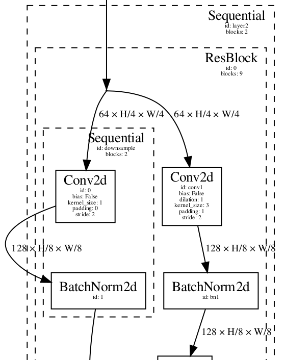

narchi - A neural network architecture definition package
=========================================================

`narchi` is as python package that provides functionalities for defining neural
network architectures in an implementation independent way. It is intended
to make network architectures highly configurable while also making the task
easier.

Main features
-------------

- Network architectures are written in `jsonnet format
  <https://jsonnet.org/>`__, which provides useful features like input
  parameters and functions to define repeated blocks.

- The shapes of the tensors internal to the networks are automatically deduced
  by propagating the shapes of the inputs, thus requiring less effort and being
  less error prone.

- Propagation of shapes is done using symbolic arithmetic which makes it
  simple to understand relationships between inputs and the derived shapes.

- Architecture files can reference other architecture files, thus making this
  approach modular.

- A command line tool is included to validate jsonnet architecture files and to
  create detailed diagrams of the respective network architectures.

- Includes a basic implementation that allows to instantiate pytorch modules
  from jsonnet architecture files without having to write a new module class
  or forward function for each new architecture.

Teaser example
--------------

Here you can see an example that illustrates what `narchi` provides. The example
is for resnet18 as implemented in torchvision, though bare in mind that the
potential of `narchi` is the ease of configurability of network architectures, not
the reimplementation of existing architectures.

Instantiating a pytorch module from the architecture file can be easily done as
follows.

.. code-block:: PYTHON

   from narchi.instantiators.pytorch import StandardModule
   module = StandardModule('resnet.jsonnet',
                           state_dict='resnet18-5c106cde.pth',
                           cfg={'ext_vars': {"num_blocks": [2, 2, 2, 2]}})

Creating a diagram of the architecture requires a single command like the following.

.. code-block:: BASH

   narchi_cli.py render \
     --ext_vars '{"num_blocks": [2, 2, 2, 2]}' \
     --nested_depth 4 \
     resnet.jsonnet \
     resnet18.pdf

Below you can see a small part of the rendered diagram of the start of the
first downsample layer of resnet18.

The part of the json that generated the previous crop of the architecture
diagram can be seen below. Note that information of the shapes is not included,
since these are derived automatically.

.. code-block:: JSON

   {
     "_class": "Sequential",
     "_id": "layer2",
     "blocks": [
       {
         "_class": "Group",
         "_name": "ResBlock",
         "blocks": [
           {
             "_class": "Identity",
             "_id": "ident"
           },
           {
             "_class": "Conv2d",
             "_id": "conv1",
             "bias": false,
             "dilation": 1,
             "kernel_size": 3,
             "output_size": 128,
             "padding": 1,
             "stride": 2
           },
           {
             "_class": "BatchNorm2d",
             "_id": "bn1"
           },
           {
             "_class": "Sequential",
             "_id": "downsample",
             "blocks": [
               {
                 "_class": "Conv2d",
                 "bias": false,
                 "kernel_size": 1,
                 "output_size": 128,
                 "padding": 0,
                 "stride": 2
               },
               {
                 "_class": "BatchNorm2d"
               }
             ]
           },
           {"...": "..."}
         ],
         "graph": [
           "ident -> conv1 -> bn1 -> relu1 -> conv2 -> bn2 -> add -> relu2",
           "ident -> downsample -> add"
         ],
         "input": "ident",
         "output": "relu2"
       }
     ]
   }
